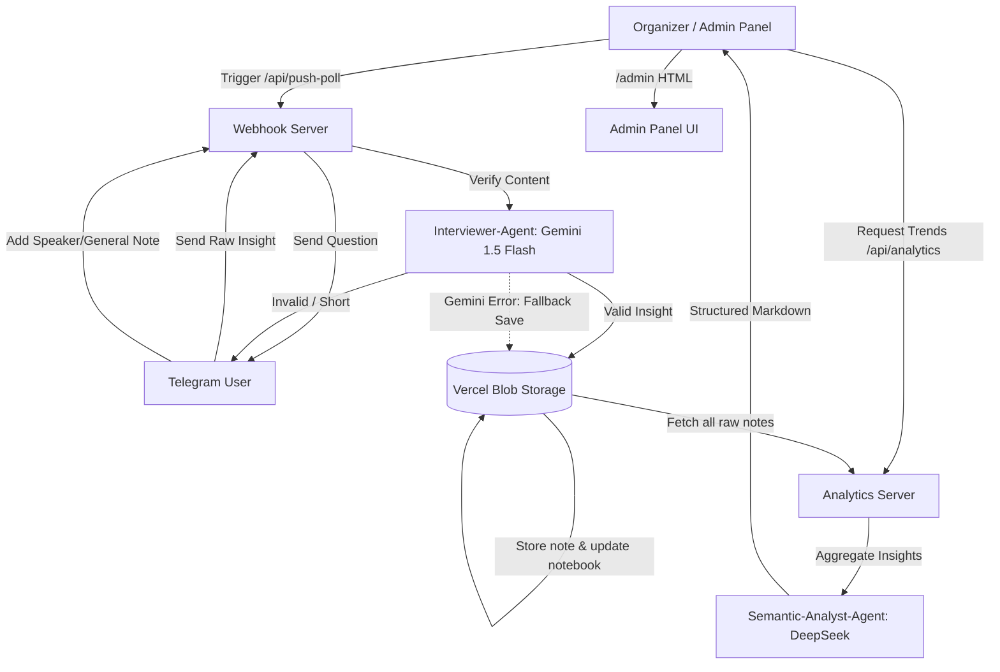

# MBA AlmaU Impact Forum — Technical Documentation

This document describes the design, system architecture, and agent integration for the MBA AlmaU Impact Forum Telegram bot.

---

## Architecture Overview

The bot uses the **Meta-Harness** methodology — an agentic framework designed to capture, validate, and synthesize crowd-sourced knowledge in real time during live events. Instead of passive listening, the system actively prompts participants for takeaways, validates their contributions using a real-time conversational agent, and aggregates raw data into high-value thematic reports for the event organizers.



---

## Data Storage

The bot uses **Vercel Blob Storage** (`@vercel/blob`) for persistent data on Vercel, with local file fallback (`db.json`) for development.

### Data Schema (`db.json`):

```json
{
  "users": {
    "<tg_id>": {
      "tg_id": 12345,
      "username": "UserName",
      "pending_session_id": null,
      "pending_note": null,
      "created_at": "2026-06-02T14:00:00Z"
    }
  },
  "sessions": {
    "<session_id>": {
      "session_id": "session_1",
      "title": "Форсайт-лекция Павла Лукши",
      "is_active": true,
      "created_at": "2026-06-02T14:00:00Z"
    }
  },
  "user_notes": {
    "<session_id>": [
      {
        "id": "abc123",
        "tg_id": 12345,
        "session_id": "session_1",
        "raw_insight": "Validated insight text",
        "timestamp": "2026-06-02T14:05:00Z"
      }
    ]
  },
  "user_notebooks": {
    "<tg_id>": "Compiled text from push-poll insights"
  },
  "categorized_notes": {
    "<tg_id>": {
      "speakers": {
        "Павел Лукша": [
          { "text": "Note text", "timestamp": "..." }
        ]
      },
      "general": [
        { "text": "General note text", "timestamp": "..." }
      ]
    }
  }
}
```

### Key Design Decisions:

- **`user_notes`** — keyed by `session_id`, used for analytics (Excel/AI trends)
- **`user_notebooks`** — keyed by `tg_id`, compiled text from push-poll insights, shown in "Весь блокнот"
- **`categorized_notes`** — keyed by `tg_id`, structured notes by speaker and general, shown in notebook sub-views
- **Blob reload strategy**: Data is reloaded from Blob on every serverless invocation (with 5-second in-memory cache for same-request reads)
- **`addRandomSuffix: false`**: Ensures consistent blob key so updates overwrite rather than create new files

---

## Agent Meta-Roles

### 1. Interviewer-Agent
* **Engine**: Google Gemini 1.5 Flash API (low-latency, conversational, cost-efficient inference).
* **Objective**: Evaluate whether the participant's text message contains a meaningful, specific, and relevant insight about the current session.
* **Fallback**: If Gemini API is unavailable (429, timeout, error), the insight is saved **without validation** to avoid data loss.
* **Requirements**:
  - Filter out generic words (e.g. "everything is fine", "cool", "normal", "great", "ok", "yes", "no").
  - Filter out spam, off-topic chats, or meaningless characters.
  - If the user's input is too short or lacks context, provide polite, constructive suggestions.
  - If the user's input is a valid insight, extract a clean, concise version of it and approve it.

#### System Prompt Template:
```text
You are the Interviewer-Agent of the Meta-Harness system.
Your goal is to validate the insights submitted by conference participants
for the session titled: "{session_title}".

Criteria:
- The insight must be meaningful, specific, and related to the session.
- Reject trivial or one-word messages.
- Reject gibberish or spam.

Response format: JSON object:
{
  "is_valid": true/false,
  "clean_insight": "Polished version in Russian",
  "feedback": "If invalid, polite message asking user to expand."
}
```

---

### 2. Semantic-Analyst-Agent
* **Engine**: DeepSeek V3/V4 (OpenAI-compatible endpoints).
* **Objective**: Analyze and synthesize hundreds of raw participant insights into a concise, actionable report for event organizers.
* **Output**: Top 5 trends, 3 unique/critical insights, 10 keywords for tag cloud.

---

## API Endpoints

| Endpoint | Method | Auth | Description |
|----------|--------|------|-------------|
| `/api/webhook` | POST | Telegram | Receives Telegram updates, processes commands and messages |
| `/api/setup` | GET | — | Sets up Telegram webhook (open in browser) |
| `/api/push-poll` | POST | `admin_password` | Sends push-poll to all registered users |
| `/api/admin` | GET/POST | `admin_password` | Admin API: list sessions, push poll, broadcast, get insights, download Excel, delete session |
| `/api/analytics` | GET/POST | `admin_password` | Excel export and AI trend analysis |

### Admin API Actions

| Action | Method | Params | Description |
|--------|--------|--------|-------------|
| `list_sessions` | GET | — | List all sessions with insight counts |
| `get_insights` | GET | `session_id` | Get all insights for a session |
| `push_poll` | POST | `session_id`, `title`, `question?` | Create session and send push-poll |
| `broadcast` | POST | `message`, `image_base64?` | Send notification to all users |
| `delete_session` | POST | `session_id` | Delete session and its insights |
| `download_excel` | GET | `session_id` | Download Excel report |

---

## Bot User Flow

### Telegram Commands & Buttons

| Button / Action | Callback | Description |
|-----------------|----------|-------------|
| `/start` | — | Register user, show main menu |
| 📅 Программа | `program` | Show program intro with day selection |
| 📅 День 1 | `program_d1` | Day 1 schedule (June 4) |
| 📅 День 2 | `program_d2` | Day 2 schedule (June 5) |
| 🎤 Спикеры | `speakers` | Show speaker biographies |
| 📓 Мой блокнот | `nb` | Show notebook menu |
| 📝 Добавить заметку по спикеру | `nb_sp` | Show speaker selection keyboard |
| 📝 Общая заметка | `nb_gn` | Set pending_note to general, prompt user |
| 🎤 [Speaker name] | `spk_N` | Set pending_note to speaker, prompt user |
| 📖 По спикерам | `nb_vsp` | View notes grouped by speaker |
| 📖 Общие заметки | `nb_vgn` | View general notes |
| 📖 Весь блокнот | `nb_all` | Compile full notebook from all sources |
| ⬅️ Главное меню | `main_menu` | Return to main menu |

---

## State Transition & Database Workflow

1. **Broadcast State**: Admin triggers `/api/push-poll` with `session_id`.
   - The bot saves the session and marks it as active (deactivating others).
   - All users' `pending_session_id` is set to the new session.
   - A question message is broadcast to all registered users.

2. **Push-Poll User Interaction**:
   - The user receives a message asking for insights.
   - Any text message sent by the user is intercepted as an insight submission.
   - The text is sent to the **Interviewer-Agent** (Gemini).
   - If Gemini is unavailable, the insight is saved as-is (fallback).

3. **Notebook Interaction**:
   - User clicks "📓 Мой блокнот" → sees notebook menu.
   - User can add a note by speaker (sets `pending_note = {type: 'speaker', name}`) or a general note (`pending_note = {type: 'general'}`).
   - The next text message from the user is saved as a categorized note.
   - Notes are stored in `categorized_notes`.

4. **Storage & Compilation**:
   - Push-poll insights: stored in `user_notes` (by session) + `user_notebooks` (by user).
   - Speaker/general notes: stored in `categorized_notes` (by user).
   - "Весь блокнот" (`nb_all`): compiles from both `user_notebooks` and `categorized_notes`.

5. Analytics & Aggregation:
   - Organizers can trigger Excel reports and AI trend analysis directly from the Admin Panel Web UI with a single click.
   - Organizers can also invoke the API endpoint `/api/analytics?action=excel` to download raw data.
   - Organizers can invoke `/api/analytics?action=trends` to run the **Semantic-Analyst-Agent** report.
   - Both analytics methods send their results directly to the admin's Telegram chat.

---

## File Structure

```
├── api/
│   ├── webhook.js      # Main bot logic (commands, callbacks, text handling)
│   ├── db.js           # Data layer (Vercel Blob + local file fallback)
│   ├── push-poll.js    # Push-poll broadcast endpoint
│   ├── analytics.js    # Excel export & AI trend analysis
│   ├── admin.js        # Admin API (sessions, insights, broadcast, Excel)
│   └── setup.js        # Webhook setup (open in browser)
├── public/
│   ├── index.html      # Landing page
│   ├── admin.html      # Admin panel (web UI)
│   └── favicon.svg     # Favicon
├── db.json             # Local data file (dev only, gitignored)
├── vercel.json         # Vercel routing & build config
├── package.json        # Dependencies
├── local-server.js     # Local development server
├── instructions.md     # User-facing setup instructions (Russian)
└── meta_harness_docs.md # This file — technical documentation
```
