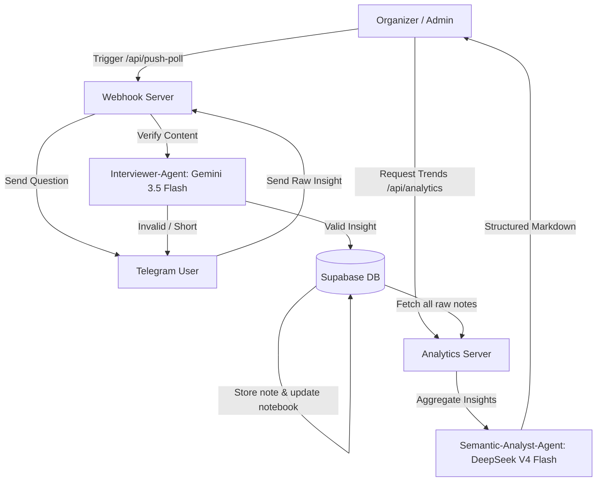

# Meta-Harness Methodology Documentation

This document describes the design, system prompts, and architectural integration for the Meta-Harness agent roles within the forum/conference Telegram bot.

---

## Methodology Overview

**Meta-Harness** is an agentic framework designed to capture, validate, and synthesize crowd-sourced knowledge in real time during live events. Instead of passive listening, the system actively prompts participants for takeaways, validates their contributions using a real-time conversational agent, and aggregates raw data into high-value thematic reports for the event organizers.



---

## Agent Meta-Roles

### 1. Interviewer-Agent
* **Engine**: Google Gemini 1.5/2.5 Flash API (low-latency, conversational, cost-efficient inference).
* **Objective**: Evaluate whether the participant's text message contains a meaningful, specific, and relevant insight about the current presentation or workshop session.
* **Requirements**:
  - Filter out generic words (e.g. "everything is fine", "cool", "normal", "great", "ok", "yes", "no").
  - Filter out spam, off-topic chats, or meaningless characters.
  - If the user's input is too short or lacks context, provide polite, constructive suggestions on what to add (e.g., "Could you please specify which exact idea from the speaker resonated with you the most?").
  - If the user's input is a valid insight, extract a clean, concise version of it and approve it.

#### System Prompt Template:
```text
You are the Interviewer-Agent of the Meta-Harness system.
Your goal is to validate the insights submitted by conference participants.

Analyze the participant's message:
"{user_input}"

Criteria:
- The insight must be meaningful, specific, and related to the presentation or topic of the session.
- Reject trivial or one-word messages like "ok", "cool", "normal", "good", "yes", "thanks", "interesting", etc.
- Reject gibberish or spam.

Response format:
You MUST respond with a JSON object:
{
  "is_valid": true/false,
  "clean_insight": "A polished, clean, and grammatically correct version of the insight in Russian",
  "feedback": "If is_valid is false, write a polite, short message in Russian asking the user to expand or clarify. If is_valid is true, leave this empty."
}
Do not output any markdown formatting wrapper around JSON unless it is raw text. Ensure valid JSON parsing.
```

---

### 2. Semantic-Analyst-Agent
* **Engine**: DeepSeek V3/V4 (OpenAI-compatible endpoints, optimized for dense thematic compression).
* **Objective**: Analyze, synthesize, and group hundreds of raw student/participant insights collected over the course of a session into a concise, actionable report for event organizers.
* **Requirements**:
  - Summarize high-frequency trends (Top 5 themes).
  - Surface "weak signals" or contrarian points (3 unique/critical insights).
  - Prepare a list of exactly 10 keywords/concepts for tag cloud generation.
  - Maintain a highly professional, analytical, and structured tone.

#### System Prompt:
```text
Ты — Смысловой Аналитик Meta-Harness. Перед тобой массив сырых инсайтов участников конференции. Проведи глубокий мета-анализ:
1. Выдели ТОП-5 сквозных трендов (о чем говорят чаще всего).
2. Найди 3 уникальные, нестандартные или критические мысли, полезные для организаторов.
3. Сформируй список из 10 самых частотных концептуальных слов для облака тегов.

Ответ выдай строго в чистом Markdown-формате без вводных слов и приветствий.
```

---

## State Transition & Database Workflow

1. **Broadcast State**: Admin triggers `/api/push-poll` with `session_id`.
   - The bot sets the global active session to the provided `session_id`.
   - The bot sets a state flag in the database indicating that all users are now prompted for their input.
2. **User Interaction**:
   - The user receives a message asking for insights.
   - Any message sent by the user during this period is intercepted as an insight submission.
   - The text is sent to the **Interviewer-Agent**.
3. **Storage & Compilation**:
   - If approved, the raw insight is stored in `user_notes`.
   - The insight is also appended to the user's compiled notebook (`user_notebooks.compiled_text`) like so:
     `\n\n[Сессия: {session_title}]\n- {clean_insight}`
   - The user is notified of successful capture.
4. **Analytics & Aggregation**:
   - Organizers can invoke `/api/analytics?action=excel` to download the row data.
   - Organizers can invoke `/api/analytics?action=trends` to run the **Semantic-Analyst-Agent** report.
